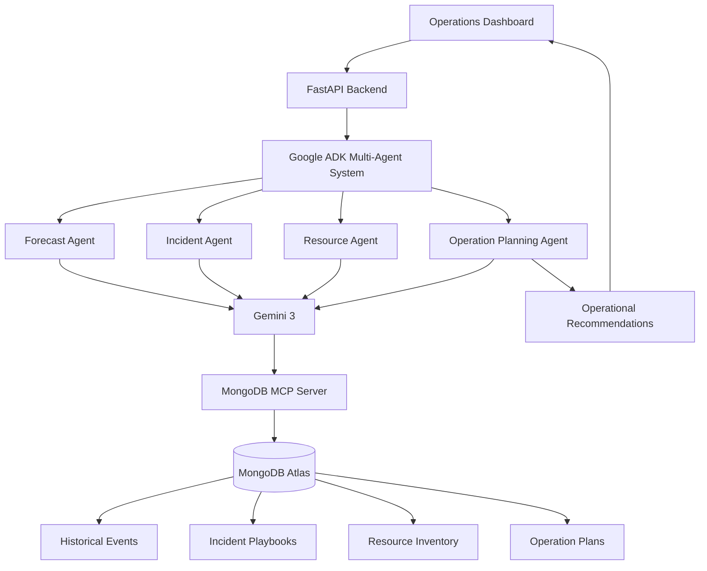

# CrowdPilot AI

### Turning Operational Data into Actionable Decisions for Large-Scale Events

## Table of Contents

- [Problem](#problem)
- [Architecture](#architecture)
- [Multi-Agent Workflow](#multi-agent-workflow)
- [MongoDB MCP Integration](#mongodb-mcp-integration)
- [Technology Stack](#technology-stack)
- [Project Structure](#project-structure)
- [Example Operational Scenario](#example-operational-scenario)
- [Hosted Project Notice](#hosted-project-notice)
- [Why CrowdPilot AI](#why-crowdpilot-ai)
- [License](#license)

---

## Problem

Large-scale events generate huge amounts of operational information:

- Historical crowd incidents
- Emergency response procedures
- Resource availability
- Venue risk assessments
- Operational playbooks

Unfortunately, this information is often scattered across documents, spreadsheets, reports, and disconnected systems.

During critical situations, operators waste valuable time searching for information instead of making decisions.

CrowdPilot AI solves this by allowing multiple AI agents to retrieve operational intelligence directly from MongoDB Atlas through MongoDB MCP and transform data into actionable plans.

---

## Architecture



---

## Multi-Agent Workflow

### Forecast Agent

Evaluates event risk levels using:

- Attendance forecasts
- Venue capacity
- Historical event intelligence
- Crowd density indicators

Outputs:

- Risk classification
- Congestion prediction
- Monitoring recommendations

### Incident Agent

Retrieves operational response procedures from MongoDB Atlas.

Outputs:

- Relevant incident playbooks
- Escalation procedures
- Emergency actions

### Resource Agent

Analyzes available operational resources.

Outputs:

- Staffing recommendations
- Equipment allocation
- Coverage analysis

### Operation Planning Agent

Combines outputs from all agents and generates:

- Deployment plans
- Risk mitigation actions
- Monitoring priorities
- Operational recommendations

---

## MongoDB MCP Integration

MongoDB serves as the operational intelligence backbone of CrowdPilot AI.

Agents access MongoDB through MongoDB MCP to retrieve:

- Historical event records
- Incident response playbooks
- Resource inventories
- Operational plans
- Risk classifications

Instead of hardcoding knowledge into prompts, agents dynamically retrieve operational intelligence at runtime.

This enables:

- Better decision making
- Scalable knowledge management
- Real-time operational grounding

---

## Technology Stack

### AI & Agents

- Gemini 3
- Google ADK
- Model Context Protocol (MCP)
- MongoDB MCP Server

### Backend

- Python
- FastAPI
- Pydantic
- Motor

### Database

- MongoDB Atlas

### Frontend

- React
- Vite
- Tailwind CSS

### Cloud & Deployment

- Render
- Vercel
- MongoDB Atlas
- Google Cloud

---

## Project Structure

```text
crowdpilot-ai/

├── frontend/
│   ├── dashboard
│   └── visualization
│
├── backend/
│   ├── agents/
│   │   ├── forecast_agent
│   │   ├── incident_agent
│   │   ├── resource_agent
│   │   └── planning_agent
│   │
│   ├── services/
│   ├── routes/
│   ├── database/
│   └── mcp_tools/
│
└── deployment/
```

---

## Example Operational Scenario

### Input

- Event Attendance: 18,000
- Venue Capacity: 20,000

### CrowdPilot AI Will

1. Assess crowd risk
2. Retrieve similar historical events
3. Analyze available resources
4. Retrieve emergency playbooks
5. Generate deployment recommendations

### Output

- Risk level
- Monitoring zones
- Staffing plan
- Resource allocation
- Incident response guidance

---

## Hosted Project Notice

**Important for Judges & Reviewers**

The hosted deployment now runs in **Production Mode**, using real **Gemini 3 Flash Preview** reasoning (`gemini-3-flash-preview`) and live MongoDB MCP integration.

- All agents (Coordinator, Forecast, Incident, Resource, Operation) operate on real operational data rather than mocked data.  
- **API quota limitations:** Gemini 3 Flash Preview requests are subject to rate limits and current API key quota. Very large or concurrent missions may fail or pause midway if the quota is exceeded.  
- To mitigate issues, the system may queue operations or gracefully handle API errors, but some actions (especially later stages like the Operation Planning Agent) may not complete if the API limit is hit.  
- For uninterrupted full production runs, upgrading your API plan or running on higher-memory instances is recommended.  
- Reviewers should be aware that partial runs due to quota limits are expected and part of normal operation under restricted API usage.  

This ensures that reviewers understand the system is fully functional in production, but may be **rate-limited or temporarily blocked** due to API constraints.

---

## Why CrowdPilot AI

Most AI systems answer questions.

CrowdPilot helps operators make decisions.

By combining Gemini reasoning with MongoDB operational intelligence through MCP, CrowdPilot demonstrates how AI agents can support real-world operational planning rather than simply generating text.

The platform focuses on turning operational data into actionable decisions, helping event operators respond faster, allocate resources more effectively, and proactively manage risks before incidents occur.

---

## License

MIT License
